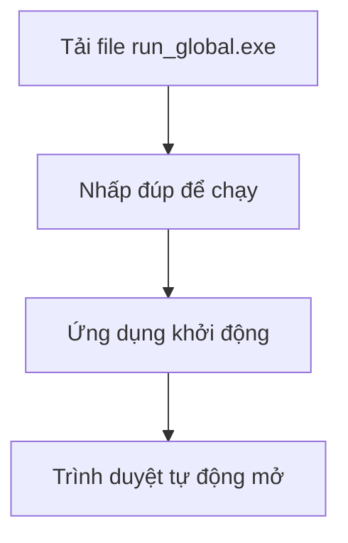
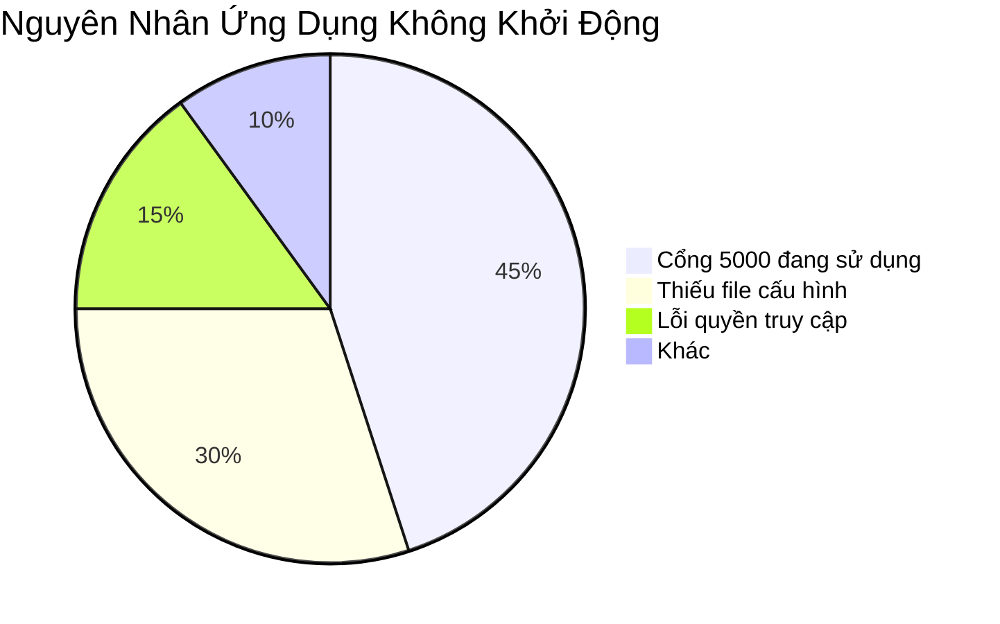

<div align="center">

# 📚 Hướng Dẫn Sử Dụng Ứng Dụng

*Công cụ quản lý và tải báo cáo tự động*

[](https://opensource.org/licenses/MIT)
[](https://github.com/your-repo)

</div>

## 📋 Mục Lục

| Mục | Mô Tả |
|-----|-------|
| [🎯 Giới Thiệu](#-giới-thiệu) | Tổng quan về ứng dụng |
| [💻 Yêu Cầu Hệ Thống](#-yêu-cầu-hệ-thống) | Cấu hình tối thiểu để chạy ứng dụng |
| 📥 [Cài Đặt](#-cài-đặt) | Hướng dẫn cài đặt chi tiết |
| 🛠️ [Hướng Dẫn Sử Dụng](#%EF%B8%8F-hướng-dẫn-sử-dụng) | Hướng dẫn sử dụng các tính năng |
| ⚠️ [Xử Lý Sự Cố](#%EF%B8%8F-xử-lý-sự-cố) | Giải pháp cho các vấn đề thường gặp |
| 📞 [Liên Hệ Hỗ Trợ](#-liên-hệ-hỗ-trợ) | Thông tin liên hệ khi cần hỗ trợ |

---

## 🎯 Giới Thiệu

Chào mừng bạn đến với **Ứng Dụng Quản Lý Báo Cáo Tự Động** - giải pháp toàn diện giúp tự động hóa quy trình tải và quản lý báo cáo của bạn.

### 🔍 Tính Năng Chính

- **Tự Động Hóa**: Tự động tải báo cáo theo lịch trình
- **Đa Nền Tảng**: Hỗ trợ nhiều nguồn dữ liệu khác nhau
- **Bảo Mật**: Mã hóa dữ liệu an toàn
- **Dễ Sử Dụng**: Giao diện trực quan, thân thiện
- **Tùy Chỉnh**: Cấu hình linh hoạt theo nhu cầu

---

## 💻 Yêu Cầu Hệ Thống

Để đảm bảo ứng dụng hoạt động mượt mà, vui lòng kiểm tra cấu hình hệ thống của bạn:

### ⚙️ Cấu Hình Tối Thiểu

| Thành Phần | Yêu Cầu |
|------------|---------|
| Hệ điều hành | Windows 10 (64-bit) trở lên |
| Bộ xử lý | Intel Core i3 hoặc tương đương |
| RAM | 4GB |
| Dung lượng đĩa | 500MB trống |
| Kết nối Internet | Băng thông tối thiểu 5Mbps |

### 📊 Cấu Hình Khuyến Nghị

| Thành Phần | Khuyến Nghị |
|------------|--------------|
| Hệ điều hành | Windows 10/11 (64-bit) |
| Bộ xử lý | Intel Core i5 hoặc cao hơn |
| RAM | 8GB trở lên |
| Dung lượng đĩa | 1GB trống (SSD) |
| Kết nối Internet | Băng thông ổn định từ 10Mbps |

### 🌐 Trình Duyệt Hỗ Trợ

- Google Chrome (phiên bản mới nhất)
- Microsoft Edge (phiên bản mới nhất)
- Mozilla Firefox (phiên bản mới nhất)
- Safari (trên macOS)
---

## 📥 Cài Đặt

### 🚀 Cài Đặt Từ File Thực Thi (Dành Cho Người Dùng Thông Thường)



1. **Tải ứng dụng**: 
   - Tải file `run_global.exe` từ thư mục `dist`
   - Lưu file vào vị trí mong muốn trên máy tính

2. **Khởi chạy ứng dụng**:
   - Nhấp đúp vào file `run_global.exe`
   - Chấp nhận cảnh báo bảo mật nếu có

3. **Truy cập ứng dụng**:
   - Ứng dụng sẽ tự động mở trình duyệt mặc định
   - Địa chỉ truy cập: `http://127.0.0.1:5000`

### 💻 Cài Đặt Từ Mã Nguồn (Dành Cho Nhà Phát Triển)

```bash
# 1. Sao chép mã nguồn
git clone [đường-dẫn-đến-repo]
cd ten-ung-dung

# 2. Tạo và kích hoạt môi trường ảo (khuyến nghị)
python -m venv venv
.\venv\Scripts\activate  # Trên Windows
source venv/bin/activate  # Trên macOS/Linux

# 3. Cài đặt thư viện
pip install -r requirements.txt

# 4. Khởi chạy ứng dụng
python run_global.py
```

### 🔍 Kiểm Tra Cài Đặt

Sau khi cài đặt, hãy kiểm tra:

1. Mở trình duyệt và truy cập: `http://127.0.0.1:5000`
2. Nếu thấy màn hình đăng nhập, việc cài đặt đã thành công
3. Nếu gặp lỗi, xem phần [Xử Lý Sự Cố](#️-xử-lý-sự-cố)

---

## 🛠️ Hướng Dẫn Sử Dụng

### 🔑 Đăng Nhập Hệ Thống

1. **Truy cập ứng dụng**:
   - Mở trình duyệt và truy cập `http://127.0.0.1:5000`
   - Nhập thông tin đăng nhập được cấp

2. **Thông tin đăng nhập mẫu**:
   - Email: `admin@example.com`
   - Mật khẩu: `mật khẩu`

3. **Xử lý đăng nhập**:
   - Nếu quên mật khẩu, nhấn "Quên mật khẩu"
   - Liên hệ quản trị nếu tài khoản bị khóa

### 🔄 Thay Đổi Mật Khẩu

1. **Truy cập trang đổi mật khẩu**:
   - Nhấn vào avatar/tên người dùng
   - Chọn "Đổi Mật Khẩu"

2. **Nhập thông tin**:
   - Mật khẩu hiện tại
   - Mật khẩu mới (tối thiểu 8 ký tự)
   - Xác nhận mật khẩu mới

3. **Lưu thay đổi**:
   - Nhấn "Lưu Thay Đổi"
   - Đăng nhập lại với mật khẩu mới

### 📊 Tải Báo Cáo

1. **Chọn loại báo cáo**:
   - Từ menu chính, chọn loại báo cáo cần tải
   - Điền các thông số bắt buộc

2. **Tùy chỉnh nâng cao**:
   - Chọn khoảng thời gian
   - Lọc theo tiêu chí cụ thể
   - Chọn định dạng xuất (XLSX, CSV, PDF)

3. **Tải xuống**:
   - Nhấn "Tải Xuống"
   - Chọn thư mục lưu trữ

### 📤 Xuất Dữ Liệu

1. **Chọn dữ liệu cần xuất**:
   - Sử dụng bộ lọc để chọn dữ liệu
   - Xem trước trước khi xuất

2. **Định dạng xuất**:
   - Excel (XLSX): Phù hợp cho phân tích chi tiết
   - PDF: Phù hợp để in ấn, báo cáo
   - CSV: Tương thích với nhiều phần mềm

3. **Tùy chọn nâng cao**:
   - Tự động đặt tên file
   - Nén thành file ZIP nếu có nhiều file
   - Gửi email tự động sau khi xuất

## ⚠️ Xử Lý Sự Cố

Dưới đây là các vấn đề thường gặp và cách khắc phục:

### 🔴 Ứng Dụng Không Khởi Động



**Cách khắc phục:**

1. **Kiểm tra cổng 5000**:
   ```bash
   # Trên Windows
   netstat -ano | findstr :5000
   
   # Trên macOS/Linux
   lsof -i :5000
   ```
   - Nếu cổng đang được sử dụng, hãy đóng ứng dụng đang chiếm cổng hoặc đổi cổng trong cấu hình

2. **Kiểm tra file cấu hình**:
   - Đảm bảo file `config.json` tồn tại trong thư mục cấu hình
   - Kiểm tra quyền đọc/ghi đối với file cấu hình

3. **Xem log lỗi**:
   - Kiểm tra file log trong thư mục `logs/`
   - Tìm kiếm các thông báo lỗi gần nhất

### 🔐 Lỗi Đăng Nhập

| Lỗi | Nguyên Nhân | Cách Khắc Phục |
|-----|------------|----------------|
| Sai thông tin đăng nhập | Nhập sai email/mật khẩu | Kiểm tra lại thông tin đăng nhập |
| Tài khoản bị khóa | Đăng nhập sai quá nhiều lần | Liên hệ quản trị viên |
| Tài khoản hết hạn | Tài khoản đã hết hạn sử dụng | Gia hạn tài khoản |

### 🌐 Lỗi Kết Nối

1. **Kiểm tra kết nối mạng**:
   - Đảm bảo máy tính đã kết nối Internet
   - Thử truy cập trang web khác để kiểm tra

2. **Kiểm tra máy chủ**:
   - Đảm bảo máy chủ đang hoạt động
   - Kiểm tra trạng thái dịch vụ:
     ```bash
     # Kiểm tra trạng thái dịch vụ
     systemctl status your-service-name
     
     # Khởi động lại dịch vụ nếu cần
     sudo systemctl restart your-service-name
     ```

3. **Kiểm tra tường lửa**:
   - Đảm bảo cổng 5000 không bị chặn
   - Thêm ngoại lệ trong tường lửa nếu cần

### 📈 Hiệu Suất Chậm

1. **Tối ưu hóa hiệu suất**:
   - Đóng các ứng dụng không cần thiết
   - Tăng cấu hình phần cứng nếu cần
   - Xóa bộ nhớ cache của ứng dụng

2. **Kiểm tra tài nguyên hệ thống**:
   - Mở Task Manager (Windows) hoặc Activity Monitor (macOS)
   - Kiểm tra mức sử dụng CPU, RAM, ổ đĩa

---

## 📞 Liên Hệ Hỗ Trợ

Chúng tôi luôn sẵn sàng hỗ trợ bạn!

### ✉️ Thông Tin Liên Hệ

| Phòng Ban | Email | Điện Thoại |
|-----------|-------|------------|
| Hỗ trợ kỹ thuật | [support@example.com](mailto:support@example.com) | 1900 1234 |
| Kinh doanh | [sales@example.com](mailto:sales@example.com) | 1900 5678 |
| Khiếu nại | [feedback@example.com](mailto:feedback@example.com) | 1900 9012 |

### 🕒 Giờ Làm Việc

- **Thứ 2 - Thứ 6**: 8:00 - 17:00
- **Thứ 7**: 8:00 - 12:00
- **Chủ nhật**: Nghỉ

### 📍 Địa Chỉ

```
Tòa nhà ABC, số 123
Đường XYZ, Phường 10
Quận 1, TP. Hồ Chí Minh
Việt Nam
```

---

## 📄 Bản Quyền & Bảo Mật

### © Bản Quyền

Bản quyền © 2024 **Công Ty Cổ Phần Công Nghệ ABC**. Mọi quyền được bảo lưu.

### 🔒 Chính Sách Bảo Mật

- Mọi thông tin cá nhân của bạn đều được bảo mật theo tiêu chuẩn quốc tế
- Chúng tôi cam kết không chia sẻ thông tin của bạn cho bên thứ ba
- Xem thêm tại [Chính sách bảo mật](#)

---

<div align="center">

### 🔄 Lịch Sử Cập Nhật

| Phiên Bản | Ngày | Mô Tả |
|-----------|------|-------|
| 1.0.0 | 20/05/2024 | Phát hành phiên bản đầu tiên |
| 1.0.1 | 25/05/2024 | Cập nhật hướng dẫn sử dụng |

*Tài liệu này được cập nhật lần cuối vào ngày 20/05/2024.*

[](https://hits.seeyoufarm.com)

</div>